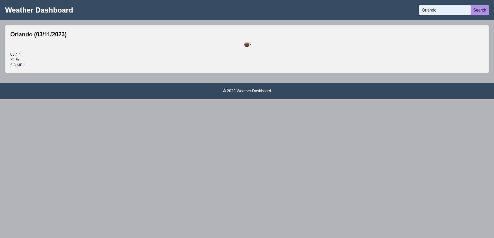

# Weather Dashboard
This is a weather dashboard web application that allows users to search for the current weather forecast of any city. The application uses the OpenWeather API to fetch weather data and displays it in a user-friendly format.

## Features
* Display the city name, date, weather icon, temperature, humidity, and wind speed for the current weather
* Responsive design that adapts to different screen sizes

## Technologies Used
* HTML
* CSS
* JavaScript
* Moment.js
* OpenWeather API

## Getting Started
To get started with the project, follow these steps:

* Clone the repository to your local machine or click on the deployed link
* Open the index.html file in a web browser.
* Search for a city using the search bar.
* View the current weather forecast for the selected city.

## Screenshot

## License
This project is licensed under the MIT License. See the LICENSE file for more information.

## Deployed Links
[Github Repo](https://github.com/Ale-Miret/weather-dashboard)